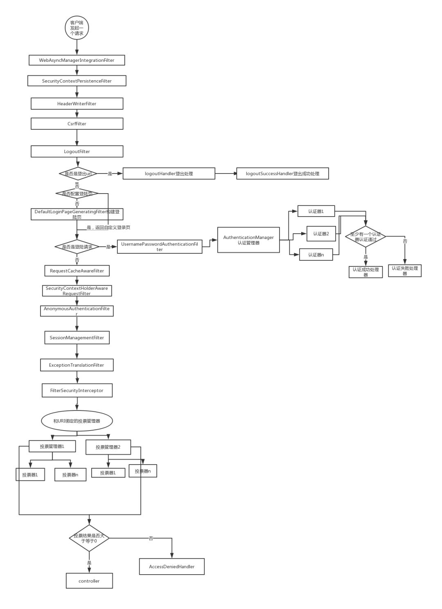

#SpringSecurity学习总结
##1.SpringSecurity功能简介
###1.1SpringSecurity核心功能
1. 认证
2. 授权
3. 攻击防护
###1.2 SpringSecurity原理
` 其核心就是一组过滤器链，项目启动后将会自动配置。最核心的就是 Basic Authentication Filter 用来认证用户的身份，一个在spring security中一种过滤器处理一种认证方式。`

####1.3 SpringSecurity 过滤器链
　　`SpringSecurity 采用的是责任链的设计模式，它有一条很长的过滤器链。现在对这条过滤器链的各个进行说明:`

1. WebAsyncManagerIntegrationFilter: 将Security上下文与Spring Web 中用于处理异步请求映射的WebAsyncManager进行集成。
2. SecurityContextPersistenceFilter：在每次请求处理之前将该请求相关的安全上下文信息加载到 SecurityContextHolder 中，然后在该次请求处理完成之后，将 SecurityContextHolder 中关于这次请求的信息存储到一个“仓储”中，然后将 SecurityContextHolder 中的信息清除，例如在Session中维护一个用户的安全信息就是这个过滤器处理的。
3. HeaderWriterFilter：用于将头信息加入响应中。
4. CsrfFilter：用于处理跨站请求伪造。
5. LogoutFilter：用于处理退出登录。
6. UsernamePasswordAuthenticationFilter：用于处理基于表单的登录请求，从表单中获取用户名和密码。默认情况下处理来自 /login 的请求。从表单中获取用户名和密码时，默认使用的表单 name 值为 username 和 password，这两个值可以通过设置这个过滤器的usernameParameter 和 passwordParameter 两个参数的值进行修改。
7. DefaultLoginPageGeneratingFilter：如果没有配置登录页面，那系统初始化时就会配置这个过滤器，并且用于在需要进行登录时生成一个登录表单页面。
8. BasicAuthenticationFilter：检测和处理 http basic 认证。
9. RequestCacheAwareFilter：用来处理请求的缓存。
10. SecurityContextHolderAwareRequestFilter：主要是包装请求对象request。
11. AnonymousAuthenticationFilter：检测 SecurityContextHolder 中是否存在 Authentication 对象，如果不存在为其提供一个匿名 Authentication。
12. SessionManagementFilter：管理 session 的过滤器
13. ExceptionTranslationFilter：处理 AccessDeniedException 和 AuthenticationException 异常。
14. FilterSecurityInterceptor：可以看做过滤器链的出口。
15. RememberMeAuthenticationFilter：当用户没有登录而直接访问资源时, 从 cookie 里找出用户的信息, 如果 Spring Security 能够识别出用户提供的remember me cookie, 用户将不必填写用户名和密码, 而是直接登录进入系统，该过滤器默认不开启。

###登录认证

通过SpringSecurity提供的AuthenticationManagerBuilder认证管理器构建器中提供登录验证之一UserDetailsService实现登录认证
~~~java
/*实现UserDetailsService，通过AuthenticationManagerBuilder认证管理器构建器实现登录验证*/
@Service
public class UserServiceImpl extends BaseService<User, Long, UserMapper> implements UserDetailsService {
    @Resource
    private UserMapper userMapper;

    @Override
    public UserDetails loadUserByUsername(String username) throws UsernameNotFoundException {
        User user = new User();
        user.setUserName(username);
        User targetName = userMapper.selectOne(user);
        if(targetName == null){
            throw  new UsernameNotFoundException("用户不存在");
        }
        //使用Authority工具创建权限collection
        List<GrantedAuthority> roles = AuthorityUtils.commaSeparatedStringToAuthorityList("role");
        /*返回的对象中的参数分别是用户名，密码，角色列表*/
        return new org.springframework.security.core.userdetails.User(targetName.getUserName(),
                new BCryptPasswordEncoder().encode(targetName.getPassword()),roles);
    }
    /*由于security启动时需要一个PasswordEncoder对象，所以在此处将这个对象交给Spring管理*/
    @Bean
    PasswordEncoder getPasswordEncoder(){
        return new BCryptPasswordEncoder();
    }
}
~~~
###自定义设置登录页面不需要认证即可访问

